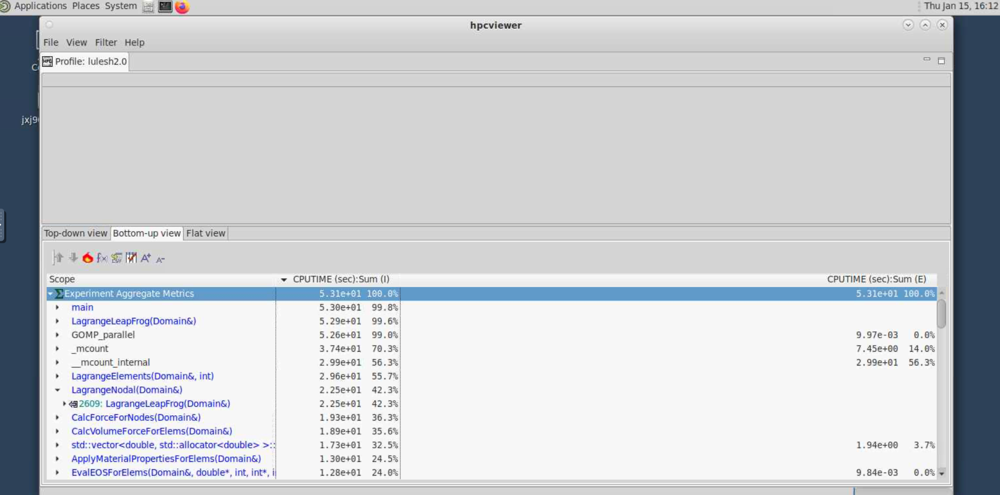

HPC Toolkit
==========================

.. admonition:: Overview
   :class: Overview

    * **Tutorial:** 45 min

        **Objectives:**
            #. Understand the basics of HPC Toolkit and how to use it for profiling applications.

HPC Toolkit is a suite of tools for performance analysis and optimization HPC applications. It provides detailed insights into the performance 
characteristics of parallel applications, helping developers identify bottlenecks and optimize their code for 
better performance.

Build the application LULESH using the following command:

..  code-block:: bash
    :linenos:

    cd /scratch/vp91/$USER
    git clone https://github.com/LLNL/LULESH.git

    cd /scratch/vp91/$USER/build_scripts/build_scripts
    ./build_lulesh.sh /scratch/vp91/$USER/LULESH

Now we will run LULESH with HPC Toolkit to collect performance data. Use the following PBS job script to submit the job:

..  code-block:: bash
    :linenos:

    cd /scratch/vp91/$USER/intro-to-profiling/job_scripts/hpctoolkit/
    qsub 1_lulesh.pbs

Once the job is complete, you will find the performance data in the output files generated by HPC Toolkit in a directory named `hpctoolkit-*`.

HPC Profiler
-----------------

To analyze the collected performance data, use the following command:

..  code-block:: bash
    :linenos:

    hpcprof <hpctoolkit-lulesh2.0-measurements-*>

This will generate a performance database, `hpctoolkit-lulesh2.0-database-*`,  that can be viewed using the HPC Toolkit's visualization tools.

HPC Viewer
-----------------

..  code-block:: bash
    :linenos:

    module load hpcviewer/2021.05.15

    hpcviewer <hpctoolkit-lulesh2.0-database-*>

On Gadi this will usualy result in an error due to missing display. To get around this, launch a `Virtual Desktop  <https://handson-with-gadi.readthedocs.io/en/latest/tutorial/are_desktop.html>`_ session on Gadi and run the above 
command in the terminal available on the Virtual Desktop. 

Once launched you can explore the performance data using the various views and analysis tools provided by HPC Toolkit. 
Look for hotspots, communication overheads, and other performance metrics to identify areas for optimization in your application.

.. admonition:: Key Points
   :class: hint

    #.  HPC Toolkit is a powerful tool for profiling and analyzing the performance of HPC applications.

    #.  It provides detailed insights into application performance, helping identify bottlenecks and optimization opportunities.

    #.  Visualization tools like HPC Viewer allow for easy exploration of performance data.

